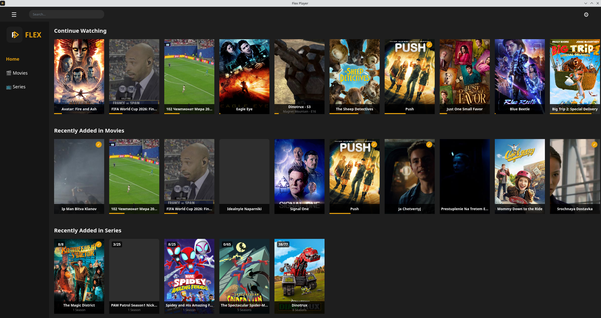
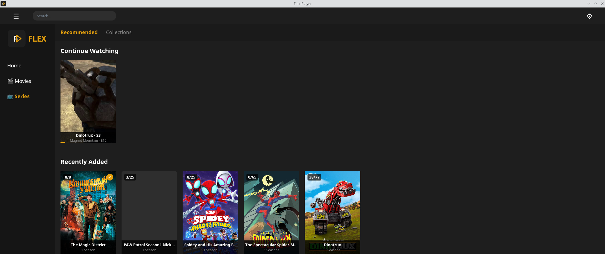
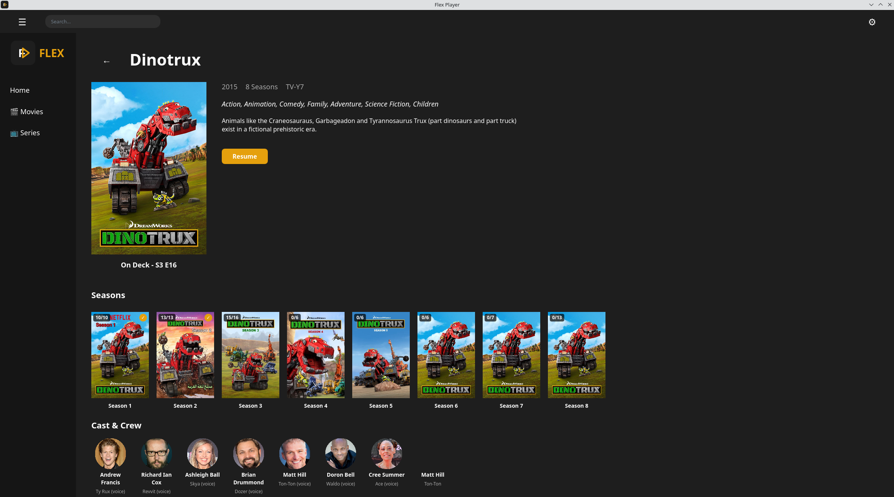

<p align="center">
  
</p>

# Flex Player

Flex Player is a custom Qt6/QML client for the Plex media server. It uses `libmpv` as its playback engine, natively supporting all the advanced features `mpv` has to offer.

## Demo

https://github.com/user-attachments/assets/44b2f970-d76e-418d-af6c-999912f4ebb6

## Installation

Flex Player is fully containerized and easily installable via Flatpak. 

You can download and install the latest Linux flatpak release directly from this repository using the command below.

```bash
TMP_DIR=$(mktemp -d) && wget -O $TMP_DIR/flex-player.flatpak https://github.com/danilovsergei/flex-player/releases/latest/download/flex-player.flatpak && flatpak install --user -y $TMP_DIR/flex-player.flatpak && rm -rf $TMP_DIR
```

*(Note: Once the application is accepted into Flathub, it will be directly available via standard `flatpak install flathub` commands.)*

## Screenshots

<p align="center">
  
</p>
<p align="center">
  
</p>
<p align="center">
  
</p>

## Why Flex Player?
The main motivation for creating Flex Player was to replace the official Flatpak and Snap Plex clients on Linux to address their architectural limitations. Specifically:
* Flex Player natively supports Wayland.
* Flex Player supports true HDR output on Linux

### 1. Native Wayland Support
The official Plex client on Linux relies on X11 abstraction layers (XWayland) by design, which fundamentally restricts performance and breaks HDR.\
Flex Player runs natively on Wayland and optimally passes video to the `libmpv` renderer, ensuring perfectly smooth playback without X11 overhead.

### 2. HDR Passthrough
Flex Player was built explicitly with HDR in mind. The Qt/QML layer performs proper HDR passthrough to `libmpv`, which boasts excellent Wayland/HDR support and can be finely tuned via `mpv.conf`.

Additionally, Flex Player automatically toggles the system HDR state in `KDE` Plasma when HDR movie playback starts, and toggle it back off when finished.\
The HDR toggle commands can be easily customized to support other desktop environments, such as `GNOME`.

## Features

### UI
Flex Player uses the Plex server API directly to fetch and display your library. Currently supported features include:
- **Home Page:**
  - Recently Added items in each library
  - Continue Watching list
- **Series library:**
  - Recently Added group by Serie name. 
  - Count of watched/total episodes groupped by Serie
  - Number of seasonds for each Serie
- **Movies library:**
  - Recently Added movies
  - Collections tab support
  - Filters and Advanced Filters
  - Saving filtered Movies as Collection and Smart collection
- **Movie Posters:**
  - Watched progress bars
  - Watched status checkmarks
- **Moview Details:**
  - Movie year , rating , description
  - Select video , audio streams and subtitles
  - Cast crew list
- **Series Details:**
  - Series year , rating , description
  - Seasons list
  - Cast crew list
- **Series Season Details:**
  - Series year , rating , description
  - Episodes list
  - Cast crew list
- **Search**
  - Search field with search as you type
  - Search popup
  - Search page wwith filters
- **Playback:** Fully featured embedded playback with auto-hiding controls.

### Player
- Report already played time to the plex server during video playback
- Inhibit screensaver while playing video
- Select subtitles and sound track
- Smooth and fast mpv like scrolling

### Settings and Customization
- Configurable Plex libraries to display in UI (Movies and Series are supported now)
- Plex SSO support to generate API token
- Detects and switches between inside/outside of local network connection to a Plex server. The same way Plex client does not
- Uses HTTPS for secure connection
- Configurable hotkeys through Settings

Application settings can be configured either through the in-app settings page or directly by editing `~/.config/flex-player/config.ini`.

### MPV Integration
Flex Player fully supports `mpv` customization via:
- Configuration file: `~/.config/flex-player/mpv/mpv.conf`
- Custom scripts: `~/.config/flex-player/mpv/scripts/`

---

## Contributing

We welcome community contributions! The project is fully backed by a rigorously maintained headless Wayland UI test suite to prevent regressions.

*For detailed instructions on how to compile the source code, run the CI test suite, and build the Flatpak locally, see **[BUILD.md](BUILD.md)**.*  
*For detailed information on the E2E UI testing architecture, see **[tests/README.md](tests/README.md)**.*

